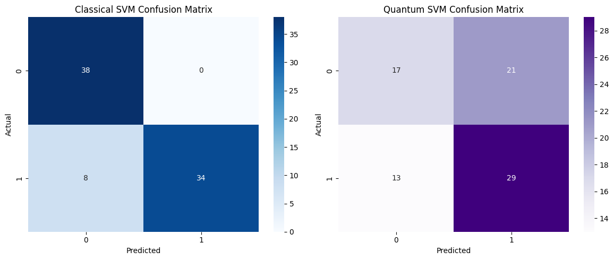
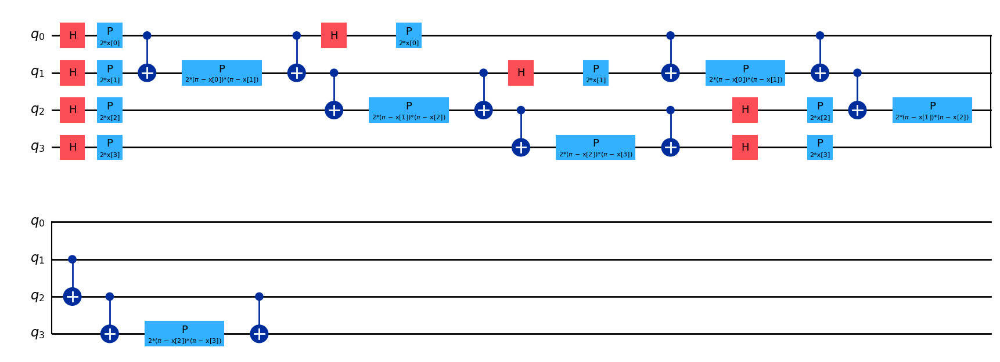

# 🔐 Quantum Machine Learning for Credit Card Fraud Detection

A comparative study of **Classical SVM** vs **Quantum SVM (QSVM)** for detecting fraudulent credit card transactions, implemented using [Qiskit](https://qiskit.org/) and [scikit-learn](https://scikit-learn.org/).

---

## 📌 Overview

This project explores the potential of Quantum Machine Learning (QML) in a real-world binary classification task — credit card fraud detection. A **ZZFeatureMap-based Quantum Kernel** is used to train a QSVM on a PCA-reduced feature space, and its performance is compared against a tuned classical RBF-SVM.

---

## 📊 Results

| Model         | Accuracy | F1 Score |
|---------------|----------|----------|
| Classical SVM | 90.00%   | 0.8947   |
| Quantum SVM   | 57.50%   | 0.6304   |

> PCA variance retained: **61.56%** across 4 components  
> Test set size: **80 samples**

The classical SVM significantly outperforms the QSVM in this experiment. The QSVM's lower performance is expected at this scale — quantum advantage typically emerges with higher-dimensional, more complex feature spaces that are difficult for classical kernels to separate.

---

## 🖼️ Confusion Matrices



---

## ⚛️ Quantum Kernel Circuit

The quantum feature map used is a **ZZFeatureMap** with `reps=2` and `linear` entanglement across 4 qubits (one per PCA component). It encodes classical data into quantum states via parameterized rotation and entangling gates, enabling the quantum kernel to capture non-linear relationships in the feature space.



---

## 🛠️ Tech Stack

- **Python 3.13**
- [`qiskit`](https://qiskit.org/) — Quantum circuit construction
- [`qiskit-machine-learning`](https://github.com/qiskit-community/qiskit-machine-learning) — `FidelityQuantumKernel`
- [`qiskit-aer`](https://github.com/Qiskit/qiskit-aer) — Local quantum simulator
- [`scikit-learn`](https://scikit-learn.org/) — SVM, PCA, GridSearchCV, metrics
- [`pandas`](https://pandas.pydata.org/), [`numpy`](https://numpy.org/) — Data handling
- [`matplotlib`](https://matplotlib.org/), [`seaborn`](https://seaborn.pydata.org/) — Visualization

---

## 📁 Project Structure
```
qsvm-fraud-detection/
├── asset/
│   ├── classicalvsquantum_confusionmatrix.png
│   └── Quantum Kernel.png
├── data/
│   └── creditcard.csv          # Not included (see below)
├── qsvm_fraud.ipynb            # Main notebook
├── .gitignore
└── README.md
```

---

## 🚀 Getting Started

### 1. Clone the repository
```bash
git clone https://github.com/your-username/qsvm-fraud-detection.git
cd qsvm-fraud-detection
```

### 2. Set up a virtual environment
```bash
python -m venv venv
source venv/bin/activate        # On Windows: venv\Scripts\activate
```

### 3. Install dependencies
```bash
pip install qiskit qiskit-machine-learning qiskit-aer scikit-learn pandas numpy matplotlib seaborn jupyter
```

### 4. Download the dataset

Download the [Credit Card Fraud Detection dataset](https://www.kaggle.com/datasets/mlg-ulb/creditcardfraud) from Kaggle and place `creditcard.csv` inside the `data/` folder.

### 5. Run the notebook
```bash
jupyter notebook qsvm_fraud.ipynb
```

---

## 🧠 Methodology

1. **Data Loading & Balancing** — Undersample the majority class (valid transactions) to match the minority class (fraud), resulting in a balanced 50/50 split.
2. **Subset Sampling** — Use 400 samples to keep quantum simulation tractable.
3. **Train/Test Split** — Stratified 80/20 split *before* any preprocessing (preventing data leakage).
4. **Standardization** — `StandardScaler` fit on training data only, then applied to test data.
5. **PCA** — Dimensionality reduction to 4 components, fit on training data only.
6. **Classical SVM** — Tuned `RBF-SVM` via `GridSearchCV` (C, gamma) with 5-fold cross-validation.
7. **Quantum SVM** — `ZZFeatureMap` (reps=2, linear entanglement) + `FidelityQuantumKernel` via Qiskit Aer simulator.
8. **Evaluation** — Accuracy, F1 Score, and confusion matrices for both models.

---

## ⚠️ Limitations

- **Quantum simulation is slow** — The QSVM uses a classical Aer simulator, not real quantum hardware. Kernel matrix computation scales as O(n²) in the number of training samples.
- **Low PCA variance retained** — Only ~61.56% of variance is preserved with 4 components, which impacts QSVM accuracy.
- **Small dataset** — 400 samples is a necessary trade-off for simulation feasibility.

---

## 📄 License

This project is open-source and available under the [MIT License](LICENSE).

---

## 🙋‍♂️ Author

Built with curiosity about the intersection of quantum computing and machine learning.  
Feel free to open an issue or submit a PR!

🤝 Connect with Me
LinkedIn: [Rupajiet Bhattacharjee](https://www.linkedin.com/in/rupajiet-bhattacharjee-60932769/)
GitHub: [@rupajietishere ](https://github.com/rupajietishere)